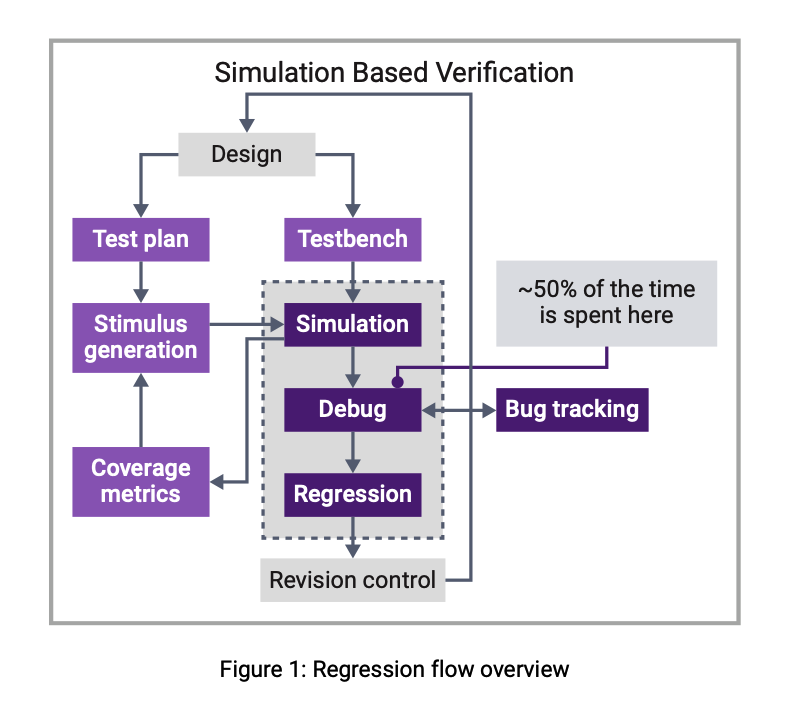

# idea note for this repo

## key insight we must use here for better experience.

首先，我们需要承认，checkpoint的颗粒度基本上一定是越小越好的。我们需要对一个project内的一类任务，都设定一个checkpoint最小颗粒度阈值。

因此我们每一次写todo文件，最好能先过一个agent，来负责进行任务规划和拆分，确保每一步的checkpoint颗粒度足够合理。没完成一个checkpoint，我们都需要进行1. 对done的检查，对下一步的再次规划确认。

`TODO/temp`下存的是被预处理decouple好的todo，需要包含对于每一个ckpt的说明，以及每一步对应的done。

## simulaton based verification

